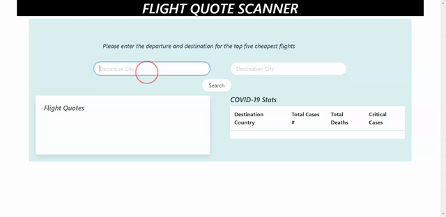

## Flight Quote Scanner

## Table of Contents

- [Description](#Description)
- [Screen Shots](#Screen-Shots)
- [Technology Used](#Technology-Used)
- [License](#license)

## Deployed Site
 [Click Here ](https://zakfena.github.io/Flight-Quote-Scanner/index.html)

## Description

This site uses two API's to get the 5 cheapest flight quotes between two different cities and also gets COVID Stats for the destination country. 


## Screen-Shots


## Technology-Used
```
HTML
CSS / BOOTSTRAP
Javascript
JQuery
AJAX
Sky Scanner API for flight info and COVID-19 API
```
## License

[](https://opensource.org/licenses/MIT)

## Question

If you have any questions please feel free to contact me.\
**Email:** zakfena@gmail.com\
**Git Hub** https://github.com/ZAKFENA

